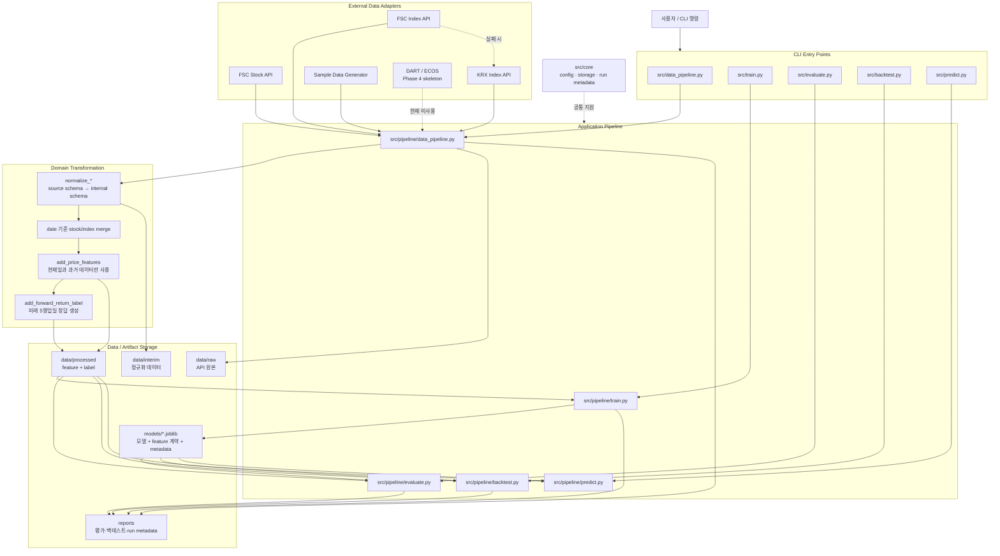
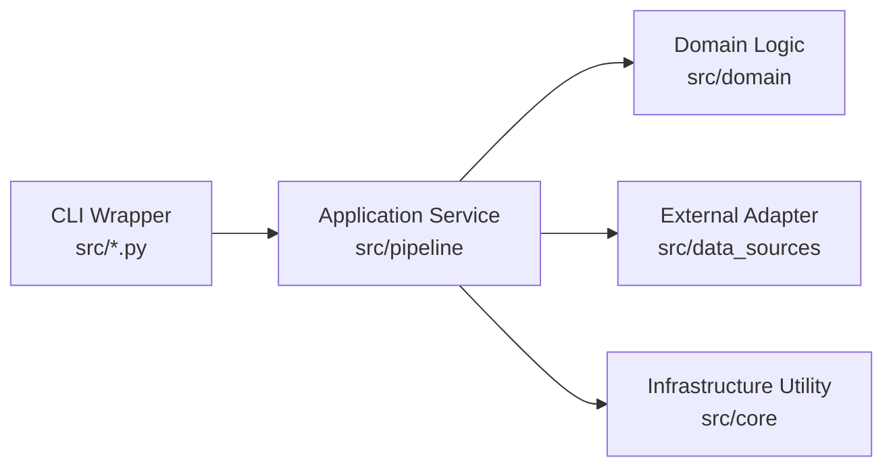
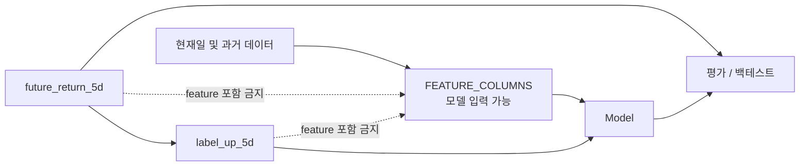

# Current Architecture

현재 구현된 stock-trend-ml의 코드 계층과 데이터 흐름을 한눈에 보기 위한 문서다. 다이어그램은 Phase 1-5 기준이며, 아직 구현되지 않은 DART와 ECOS는 미래 확장 영역으로 구분한다.

## 1. 전체 아키텍처



## 2. 코드 계층



| 계층 | 백엔드 비유 | 주요 책임 |
|---|---|---|
| `src/*.py` | Controller | CLI 인자를 받고 실제 pipeline의 `main()` 호출 |
| `src/pipeline` | Application Service | 수집, 변환, 학습, 평가 순서를 조립 |
| `src/domain` | Domain Service | feature, label, sample 데이터 변환 |
| `src/data_sources` | API Client / Adapter | 외부 API 호출과 표준 schema 정규화 |
| `src/core` | Configuration / Repository Utility | 환경설정, 파일 I/O, 실행 metadata |

## 3. 실행 순서와 산출물

```text
1. data_pipeline
   API/sample → raw → normalize → interim → merge → feature → label → processed

2. train
   processed dataset → 날짜순 train/validation/test → 모델 선택 → joblib

3. evaluate
   test 구간 + model → 분류 지표 → model_comparison.md / predictions.csv

4. backtest
   test 구간 + model → 거래비용 반영 참고 지표 → backtest_summary.md

5. predict
   latest_features + model → 최신 날짜의 방향과 확률 출력
```

전체 실행 명령:

```bash
python3 src/data_pipeline.py --ticker 005930 --start 2018-01-01 --end 2025-12-31 --use-sample
python3 src/train.py --ticker 005930
python3 src/evaluate.py --ticker 005930
python3 src/backtest.py --ticker 005930
python3 src/predict.py --ticker 005930
```

## 4. 데이터 누수 경계



- `return_5d`는 현재와 과거 5영업일의 수익률이므로 feature다.
- `future_return_5d`는 5영업일 뒤 종가로 만든 값이므로 label 생성과 평가에만 사용한다.
- `label_up_5d`는 학습 정답이며 입력 feature에는 포함하지 않는다.
- train, validation, test는 날짜순으로 나눈다. random split을 사용하지 않는다.
- rolling feature는 장 마감 후 예측을 전제로 현재일을 포함하지만 미래일은 포함하지 않는다.

## 5. 디렉토리 지도

```text
stock-trend-ml/
├── src/
│   ├── *.py              # CLI entry points와 호환 wrapper
│   ├── pipeline/         # 데이터·학습·평가·백테스트·예측 orchestration
│   ├── domain/           # feature, label, sample 변환 규칙
│   ├── data_sources/     # FSC/KRX API adapter, DART/ECOS skeleton
│   └── core/             # config, storage, run metadata
├── data/
│   ├── raw/              # API 원본
│   ├── interim/          # 정규화 결과
│   └── processed/        # 모델용 dataset과 latest features
├── models/               # 학습된 model artifact
├── reports/              # 실행 결과와 metadata
├── tests/                # schema, 누수, fallback, metadata 검증
└── docs/
    ├── architecture/     # 현재 문서
    ├── study/            # 학습 노트
    ├── logs/             # 작업 기록
    └── prompts/          # Agent 작업 계획
```

## 6. 읽기 시작점

1. 이 문서에서 전체 구조를 확인한다.
2. `src/data_pipeline.py`에서 실제 `src.pipeline.data_pipeline.main`으로 이동한다.
3. `build_dataset()`의 호출을 따라 `data_sources`, `domain`, `core`를 읽는다.
4. `src/pipeline/train.py`에서 날짜 분할과 모델 Pipeline을 읽는다.
5. 평가와 투자 성과의 차이를 `evaluate.py`, `backtest.py`에서 비교한다.

더 자세한 설명은 `docs/study/phase_1_5_pipeline_execution_flow_study.md`와 `docs/study/phase_1_5_code_guide_study.md`에서 확인한다.
